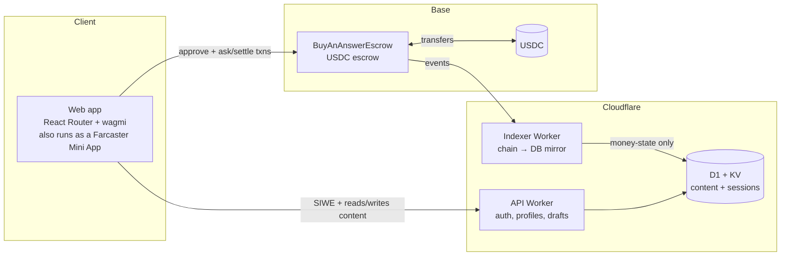

# Architecture

**BuyAnAnswer** — your link in bio, but every tip buys a real answer. Ask a creator a question, escrow
USDC on Base, and you're only charged when they answer — refunded if they don't.

This is a public overview of how the system fits together and why the money is safe. For how to report a
security issue, see [`SECURITY.md`](./SECURITY.md).

---

## The idea

A creator shares one link. A fan asks a question and escrows USDC for it. The creator can **answer**
(and get paid, minus a small platform fee) or **decline** (the fan is refunded in full). If the creator
does neither, the fan can **cancel** before a deadline, and after the deadline **anyone** can reclaim the
funds back to the fan — so money is never stuck.

The escrow is **non-custodial**: funds live in a smart contract on Base, not in a company account. The
chain is the source of truth for every payment.

---

## System at a glance

- **Smart contract (Base, Solidity + Foundry).** `BuyAnAnswerEscrow` holds USDC per question and pays
  out through a pull-payment ledger. It is the only place money lives. Source:
  [`contracts/src/BuyAnAnswerEscrow.sol`](./contracts/src/BuyAnAnswerEscrow.sol).
- **Indexer (Cloudflare Worker).** Watches the contract's events and mirrors on-chain state into the
  database. It is the **sole writer of payment state** off-chain — it reflects the chain, it never
  authorizes a payment.
- **API (Cloudflare Worker).** Wallet sign-in (Sign-In with Ethereum), creator profiles, and the
  content half of a question/answer (the question text and the hidden answer body). It never writes
  payment state.
- **Web app (React Router).** The link-in-bio board, the ask-and-pay flow, and the creator inbox. It
  talks to both the API (content) and the contract (money, signed by the user's own wallet).
- **Farcaster Mini App.** The same web app, loaded in a webview inside a Farcaster client with a
  wallet provider injected. It is not a separate service: sharing a board renders an in-feed launch
  button, and the ask-and-pay flow that runs is the identical one the web uses. A manifest at
  `/.well-known/farcaster.json` and an `fc:miniapp` embed tag are all that distinguish it.

---

## The money lifecycle

A question starts `Open` when its USDC is escrowed and ends in exactly one terminal state:

| Action | Who | When | Result |
|---|---|---|---|
| **Answer** | the creator | while open | creator paid `amount − fee`; platform gets the fee |
| **Decline** | the creator | while open | asker refunded 100% (no fee) |
| **Cancel** | the asker | before the deadline | asker refunded `amount − small fee` |
| **Reclaim** | anyone | at/after the deadline | asker refunded 100% (no fee) |

Settlements never push USDC out directly. They **credit an internal balance**, and each recipient later
`withdraw()`s their own funds. This isolates every account: a stuck or malicious recipient can only ever
block their own withdrawal, never anyone else's payout.

---

## Why the money is safe

- **Non-custodial & chain-authoritative.** Funds are held by the contract on Base; the off-chain
  database only mirrors what the chain already decided.
- **Settles at most once.** Every question flips to a final state *before* any balance is credited, so a
  question can never be paid out twice.
- **Always solvent.** At every moment, the USDC held by the contract equals the sum of open escrows plus
  all credited-but-unwithdrawn balances — proven by the contract's property tests.
- **Bounded operator.** The platform can adjust fees only within **hard caps written into the contract**
  (and can pause new asks in an emergency), but it can **never** seize escrowed funds, raise a fee past
  its cap, or block a withdrawal.
- **Pull payments + reentrancy-guarded.** Funds leave only through `withdraw()`, which zeroes a balance
  before transferring, under a reentrancy guard.
- **Refunds can't be trapped.** A fan can always get their money back if a creator goes silent — cancel
  before the deadline, or permissionlessly reclaim after it. A pause never blocks withdrawals.

Off-chain, every state-changing request is authorized server-side against a wallet-signed session, all
inputs are validated at the edge, and abuse controls are rate-limited and fail closed.

---

## Tech stack

| Layer | Choice |
|---|---|
| Smart contract | Solidity 0.8.28, Foundry, OpenZeppelin (`Ownable2Step`, `Pausable`, `ReentrancyGuard`, `SafeERC20`) |
| Chain / asset | Base · native USDC (6 decimals) |
| Services | Cloudflare Workers (web, API, indexer), D1 (SQL), KV (sessions & rate limits) |
| Web | React Router (SSR), wagmi + viem, Sign-In with Ethereum |
| Distribution | Farcaster Mini App |

The contract is a separate Foundry toolchain from the TypeScript monorepo; see
[`contracts/README.md`](./contracts/README.md) to build and test it.

---

## Current deployment

The escrow is **live on Base mainnet** at
[`0x04a814daa6421D5B0C7f3758476f0150D48198b6`](https://basescan.org/address/0x04a814daa6421D5B0C7f3758476f0150D48198b6#code)
(source-verified on Basescan), holding Circle's native USDC. Contract ownership is a
[Safe](https://basescan.org/address/0xEc1276A188df9603fE280a42eBbeB90f32aa6034), not a hot EOA. The
**Base Sepolia** deployment at
[`0x40A4bfEc9441752BcABBd4b3939503671c8724dB`](https://sepolia.basescan.org/address/0x40A4bfEc9441752BcABBd4b3939503671c8724dB)
remains available for testing.

Full addresses, deploy blocks, fee parameters, and how to reproduce the build are in the
[README](./README.md#deployment).

The contract has **not** had an external security audit. See
[`SECURITY.md`](./SECURITY.md#assurance-and-known-limitations) for what was done instead, and what
that means for you.
